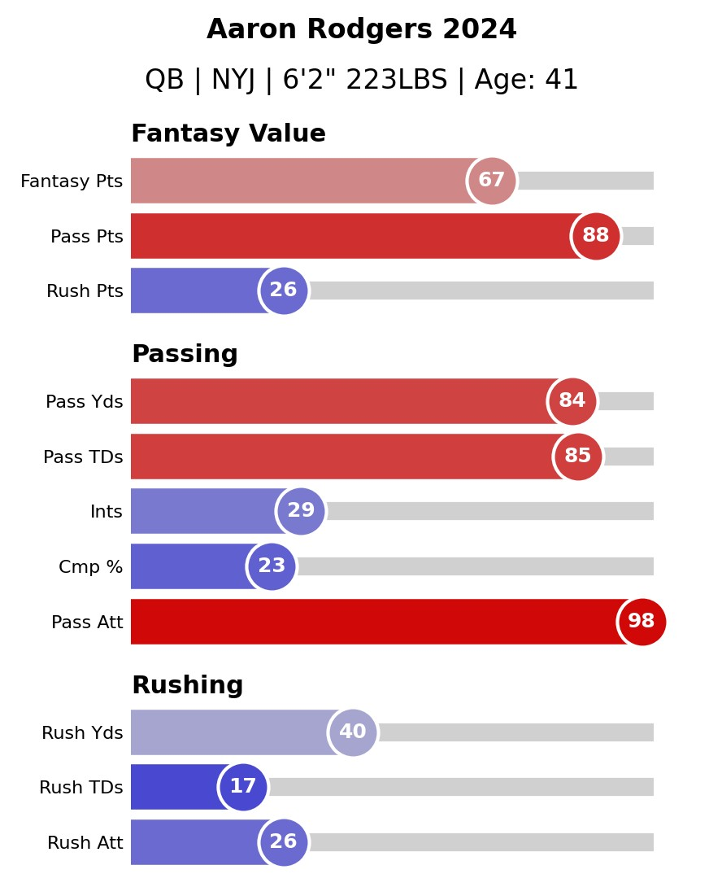
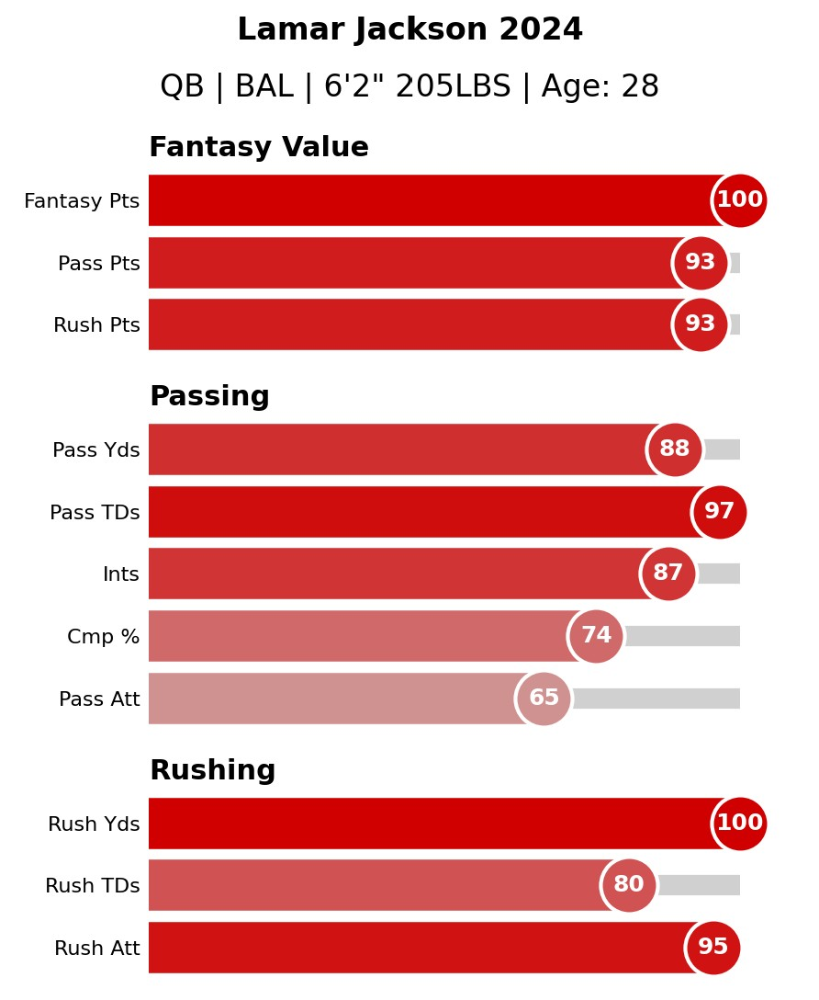

# Fantasy Football Savant

Fantasy Football Savant is a project that aims to recreate the lollipop charts from [Baseball Savant](https://baseballsavant.mlb.com/) but for fantasy football. These intuative lollipop chart visualizations highlight key player metrics for each of the positions used in fantasy football leagues (QB, RB, WR, TE), and provide a clean and concise way to evaluate player performance and compare metrics at a glance.

---

## Example Visualizations

Below are sample lollipop charts generated for NFL players:

<div style="display: flex; justify-content: space-around; align-items: center;">
    
    
</div>

---

## Features

- **Data Fetching**: Fetches seasonal and player information data using `nfl-data-py`.
- **Data Preprocessing**: Calculates key metrics and percentiles based on qualifying players.
- **Position Profiles**: Defines position-specific player profiles (e.g., QB, RB, WR, TE) to organize data and generate insights.
- **Lollipop Charts**: Creates lollipop visualizations for easy comparison of player performance metrics.

---

## Project Structure

```
.
├── data/                  # Raw and processed data
│   ├── raw/               # Raw data files
│   ├── processed/         # Processed data files
├── src/                   # Source code for the project
│   ├── fetch_data.py      # Fetch and save raw data
│   ├── preprocess_data.py # Preprocess data and calculate percentiles
│   ├── profiles.py        # Player profile classes (QB, RB, WR, TE)
│   ├── metrics_utils.py   # Utility functions for metric calculations
│   ├── lollipop_chart.py  # Functions for generating lollipop charts
│   ├── main.py            # Entry point for the project
├── README.md              # Project overview and instructions
├── requirements.txt       # Python dependencies
```

---

## Prerequisites

- Python 3.8 or higher

---

## Installation Instructions

1. **Clone the Repository**:

   ```bash
   git clone https://github.com/calebfederman/FantasyFootballSavant.git
   cd FantasyFootballSavant
   ```

2. **Set Up Virtual Environment**:

   ```bash
   python -m venv .venv
   ```

3. **Activate Virtual Environment**:

   - **Windows**:
     ```bash
     .\.venv\Scripts\activate
     ```
   - **Mac/Linux**:
     ```bash
     source .venv/bin/activate
     ```

4. **Install Dependencies**:

   ```bash
   pip install -r requirements.txt
   ```
   
---

## Running the Project

1. **Run the Main Script**:

   ```bash
   python src/main.py
   ```

2. **Enter Player ID**: When prompted, enter the desired player's ID (ex. 00-002459 for Aaron Rodgers) to generate a lollipop chart visualization. You can find the player ID's in the processed data once the preprocessing step is complete.

---

## Acknowledgments

- [nfl-data-py](https://pypi.org/project/nfl-data-py/) for providing easy access to NFL data.
- Inspiration from Baseball Savant's visualization style.

